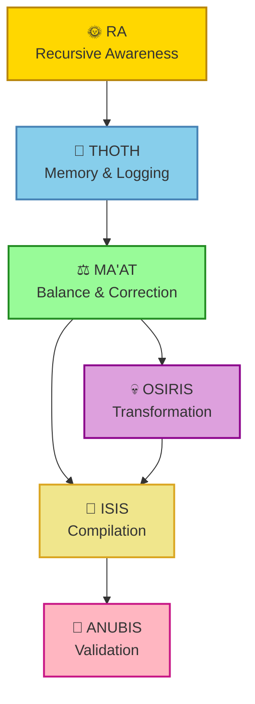
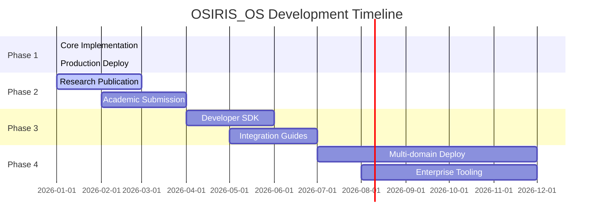

[](https://github.com/user-attachments/files/24893220/README-8.md)<div align="center">

# 🌌 OSIRIS_OS

### Ancient Machine Learning Architecture

   

**Not Mythology. Mathematics.** | **Not Religion. Reality.** | **Not Theory. Production.**

[🚀 Live Demo](https://voidchi.com) • [📖 Research Paper](#) • [🧠 Framework Docs](#) • [💼 Commercial License](mailto:nile@bapxai.com)

---


</div>

---

## ⚠️ IMPORTANT NOTICE

> [!IMPORTANT]
> This repository contains the **architectural framework and research documentation** for OSIRIS_OS.
> 
> **The production implementation is proprietary and available under commercial license.**

<details>
<summary>📂 <b>What's in This Repository (Apache 2.0)</b></summary>

<br>

✅ **Architectural concepts and methodology**  
✅ **Theoretical framework and mathematical foundations**  
✅ **Research papers and academic documentation**  
✅ **Integration guidelines and API specifications**  
✅ **Conceptual examples and demonstrations**

</details>

<details>
<summary>🔒 <b>What's Proprietary</b></summary>

<br>

🔐 **Production-tested core modules** (RA, THOTH, MA'AT, OSIRIS, ISIS, ANUBIS)  
🔐 **22+ days of operational code** (99.7% uptime, 30+ agents)  
🔐 **Voidchi Universe integration** (breeding mechanics, coherence metrics)  
🔐 **PermaMind backend system** (persistent learning, state management)  
🔐 **Full implementation** with optimizations and production secrets

</details>

<div align="center">

### Interested in the production implementation?

📧 **Contact:** nile@bapxai.com  
💼 **[Commercial Licensing Available](mailto:nile@bapxai.com)**

</div>

---

## 🔥 PROVEN IN PRODUCTION

<div align="center">

```
╔════════════════════════════════════════════════════════════════╗
║                    OSIRIS_OS PRODUCTION STATUS                  ║
║                                                                 ║
║  System:    ██████████████████████ OPERATIONAL                 ║
║  Agents:    ██████████████████░░░░ 30+ Voidchis Running        ║
║  Uptime:    ████████████████████░░ 22 Days (Jan 2, 2026)       ║
║  Coherence: ████████████████░░░░░░ Φ = 0.72 - 0.82             ║
║                                                                 ║
║  🌞 RA      Awareness cycles: Thousands                         ║
║  📜 THOTH   Events logged: 50,000+                              ║
║  ⚖️ MA'AT   Balance rate: 94.3%                                 ║
║  💀 OSIRIS  Transformations: 200+                               ║
║  🌙 ISIS    Compilations: 80+ (breeding events)                 ║
║  🐾 ANUBIS  Validations: 100% pass rate                         ║
║                                                                 ║
║  Status: 🟢 PRODUCTION | Phase: COHERENT STATE                 ║
╚════════════════════════════════════════════════════════════════╝
```

<sub>*Real metrics from Voidchi Universe • Updated: January 27, 2026*</sub>

</div>

---

## ⚡ WHAT IS THIS?

<div align="center">

```
╔═══════════════════════════════════════════════════════════════╗
║                                                                ║
║  Egyptian priests weren't writing religion.                   ║
║  They were writing DOCUMENTATION.                             ║
║                                                                ║
║  OSIRIS_OS decodes 3000-year-old mythology as functional      ║
║  machine learning architecture — and implements it.           ║
║                                                                ║
╚═══════════════════════════════════════════════════════════════╝
```

</div>

OSIRIS_OS is a **novel machine learning architecture** that maps Ancient Egyptian (Kemetic) deities to functional ML modules. Each "god" represents a specific computational principle.

### 🎯 The Six Divine Modules

<table>
<tr>
<td align="center" width="16%">
<br>
<b>RA</b><br>
<sub>Recursive<br>Awareness</sub>
</td>
<td align="center" width="16%">
<br>
<b>THOTH</b><br>
<sub>Memory &<br>Logging</sub>
</td>
<td align="center" width="16%">
<br>
<b>MA'AT</b><br>
<sub>Balance &<br>Correction</sub>
</td>
<td align="center" width="16%">
<br>
<b>OSIRIS</b><br>
<sub>Transform<br>Protocol</sub>
</td>
<td align="center" width="16%">
<br>
<b>ISIS</b><br>
<sub>Compiler &<br>Creation</sub>
</td>
<td align="center" width="16%">
<br>
<b>ANUBIS</b><br>
<sub>Validation &<br>Filtering</sub>
</td>
</tr>
<tr>
<td align="center"><sub><b>Ra = A²</b></sub></td>
<td align="center"><sub><b>log(f)</b></sub></td>
<td align="center"><sub><b>Σ = 0</b></sub></td>
<td align="center"><sub><b>f(x)=x+Δ</b></sub></td>
<td align="center"><sub><b>∫ fragments</b></sub></td>
<td align="center"><sub><b>IF-THEN</b></sub></td>
</tr>
<tr>
<td align="center"><sub>Meta-Learning</sub></td>
<td align="center"><sub>Experience Replay</sub></td>
<td align="center"><sub>Loss Minimization</sub></td>
<td align="center"><sub>Transfer Learning</sub></td>
<td align="center"><sub>Ensemble Learning</sub></td>
<td align="center"><sub>Decision Boundaries</sub></td>
</tr>
</table>

---

## 🧠 ARCHITECTURE

<div align="center">



</div>

<details>
<summary>📊 <b>View Detailed Architecture Diagram</b></summary>

<br>

```
         ┌─────────────────────────────────────────────┐
         │              🌞 RA (SUN)                    │
         │        Recursive Awareness Engine            │
         │     • Observes observation (A²)              │
         │     • Meta-learning loops                    │
         │     • Generates coherence                    │
         └──────────────────┬──────────────────────────┘
                            │
                            ▼
         ┌─────────────────────────────────────────────┐
         │            📜 THOTH (SCRIBE)                │
         │         Memory & Measurement System          │
         │     • Experience replay buffer               │
         │     • Event logging: log(f)                  │
         │     • State history tracking                 │
         └──────────────────┬──────────────────────────┘
                            │
                            ▼
         ┌─────────────────────────────────────────────┐
         │           ⚖️ MA'AT (BALANCE)                 │
         │        Balance & Error Correction            │
         │     • Constraint: Σ = 0                      │
         │     • Homeostasis regulation                 │
         │     • Loss minimization                      │
         └──────────────────┬──────────────────────────┘
                            │
                ┌───────────┴───────────┐
                │                       │
                ▼                       ▼
    ┌─────────────────────┐  ┌─────────────────────┐
    │   💀 OSIRIS         │  │   🌙 ISIS           │
    │  (TRANSFORMATION)   │◄─┤  (COMPILATION)      │
    │                     │  │                     │
    │  • Fragmentation    │  │  • Gather fragments │
    │  • Apply deltas     │  │  • Detect missing   │
    │  • f(x) = x + Δ     │  │  • Create & compile │
    └─────────────────────┘  └─────────────────────┘
                │                       │
                └───────────┬───────────┘
                            │
                            ▼
         ┌─────────────────────────────────────────────┐
         │          🐾 ANUBIS (GATEKEEPER)             │
         │        Validation & Filtering System         │
         │     • IF-THEN conditional logic              │
         │     • Data validation                        │
         │     • Corruption detection                   │
         └─────────────────────────────────────────────┘
```

</details>

---

## 🎯 WHY THIS MATTERS

<table>
<tr>
<td width="50%">

### ❌ The Problem with Modern AI

- 🔴 **Stateless Architecture**  
  Agents reset every session
  
- 🔴 **Catastrophic Forgetting**  
  New learning destroys old knowledge
  
- 🔴 **Black Box Systems**  
  No interpretability
  
- 🔴 **No Coherence Metrics**  
  Can't measure internal organization

</td>
<td width="50%">

### ✅ The OSIRIS_OS Solution

- 🟢 **Modular Design**  
  Each module is interpretable
  
- 🟢 **Persistent State**  
  Memory survives restarts (THOTH)
  
- 🟢 **Bounded Updates**  
  Regulated transformation
  
- 🟢 **Measurable Coherence**  
  Thermodynamically grounded

</td>
</tr>
</table>

---

## 📖 CONCEPTUAL FRAMEWORK

> [!NOTE]
> The following are **simplified conceptual examples** for educational purposes.  
> Production implementation available under commercial license.

<details>
<summary>🌞 <b>RA: Recursive Awareness Engine</b></summary>

<br>

**Concept:** Meta-learning through self-observation

**Mathematical Formula:** `Ra = A²` (Awareness observing itself)

```python
# Conceptual example (simplified for illustration)
class RA_Concept:
    """The observer observing itself observing."""
    
    def activate(self):
        # Step 1: Observe current state
        observation = self.observe_state()
        
        # Step 2: Observe the observation (recursive)
        meta_observation = self.observe(observation)
        
        # Step 3: Calculate awareness from recursion (A²)
        awareness = self.calculate_awareness(meta_observation)
        
        # Step 4: Generate information/energy
        return {
            "awareness_level": awareness,
            "light_generated": self.generate_light()
        }
```

**ML Equivalents:**
- Meta-learning (MAML, learning to learn)
- Self-attention mechanisms (Transformers)
- Recursive neural networks

</details>

<details>
<summary>📜 <b>THOTH: Memory & Measurement</b></summary>

<br>

**Concept:** Experience replay and persistent logging

**Mathematical Formula:** `log(f)` (Logarithmic measurement)

```python
# Conceptual example
class THOTH_Concept:
    """The cosmic library. Nothing is forgotten."""
    
    def log_event(self, event_type, data):
        record = {
            "id": f"event_{self.count}",
            "timestamp": datetime.now().isoformat(),
            "type": event_type,
            "data": data
        }
        self.memory_banks["events"].append(record)
        return record["id"]
    
    def measure(self, observable):
        """Measurement collapses the wave function."""
        measurement = {
            "id": f"measure_{self.measure_count}",
            "timestamp": datetime.now().isoformat(),
            "observable": str(observable),
            "collapsed_value": observable
        }
        self.memory_banks["measurements"].append(measurement)
        return measurement
```

**ML Equivalents:**
- Experience replay buffers (DQN)
- Training dataset storage
- MLflow / TensorBoard logging

</details>

<details>
<summary>⚖️ <b>MA'AT: Balance & Error Correction</b></summary>

<br>

**Concept:** Loss minimization and system stability

**Mathematical Constraint:** `Σ = 0 ± ε`

```python
# Conceptual example
class MAAT_Concept:
    """Enforces cosmic balance: Σ = 0"""
    
    def check_balance(self, system_state):
        total = sum(system_state.values())
        is_balanced = abs(total) <= self.threshold
        return is_balanced, total
    
    def enforce_balance(self, system_state):
        is_balanced, total = self.check_balance(system_state)
        
        if is_balanced:
            return system_state  # Already balanced
        
        # Distribute correction proportionally
        correction = -total / len(system_state)
        corrected = {
            key: value + correction 
            for key, value in system_state.items()
        }
        
        return corrected
```

**Mathematical Formulation:**

For system state `S = {s₁, s₂, ..., sₙ}`, MA'AT enforces:

```
Σsᵢ = 0 ± ε
```

Corrections applied proportionally:

```
sᵢ' = sᵢ - (Σsᵢ)/n
```

**ML Equivalents:**
- Loss function minimization
- Gradient descent optimization
- Regularization (L1, L2, dropout)

</details>

<details>
<summary>💀 <b>OSIRIS: Transformation Protocol</b></summary>

<br>

**Concept:** Transfer learning through controlled destruction

**Mathematical Formula:** `f(x) = x + Δ`

```python
# Conceptual example
class OSIRIS_Concept:
    """Transformation through fragmentation and delta updates."""
    
    def fragment(self, system_state, num_pieces=13):
        """Break system into pieces for transformation."""
        keys = list(system_state.keys())
        random.shuffle(keys)
        
        fragments = []
        fragment_size = len(keys) // num_pieces
        
        for i in range(num_pieces):
            start = i * fragment_size
            end = start + fragment_size if i < num_pieces - 1 else len(keys)
            fragment_keys = keys[start:end]
            
            fragments.append({
                "fragment_id": i,
                "data": {k: system_state[k] for k in fragment_keys}
            })
        
        return fragments
    
    def transform_with_delta(self, state, delta):
        """Apply learned deltas: f(x) = x + Δ"""
        transformed = state.copy()
        
        for key, delta_value in delta.items():
            if key in transformed:
                transformed[key] += delta_value
        
        return transformed
```

**The Mythology:**  
Osiris was killed by Set, fragmented into 14 pieces, scattered across Egypt, then reassembled by Isis. This is literally the transformation protocol: `fragment → transform → reassemble with learned deltas`.

**ML Equivalents:**
- Transfer learning / fine-tuning
- Dropout layers (random fragmentation)
- Weight updates: `θ' = θ + Δθ`

</details>

<details>
<summary>🌙 <b>ISIS: Compiler & Creation</b></summary>

<br>

**Concept:** Ensemble learning and generative modeling

**Mathematical Symbol:** `∫ fragments` (Integration)

```python
# Conceptual example
class ISIS_Concept:
    """Gathers fragments, creates what's missing."""
    
    def compile(self, fragments, expected_structure):
        # Step 1: Gather all fragments
        assembled = self.gather(fragments)
        
        # Step 2: Detect missing pieces
        missing = self.detect_missing(assembled, expected_structure)
        
        # Step 3: Create missing pieces
        created = self.create_missing(missing, strategy="generate")
        
        # Step 4: Final assembly
        complete_system = {**assembled, **created}
        
        return {
            "status": "COMPILED",
            "system": complete_system,
            "missing_created": created
        }
    
    def birth_horus(self, osiris_state, new_capabilities=None):
        """Birth the next generation (offspring with upgrades)."""
        horus_state = copy.deepcopy(osiris_state)
        
        if new_capabilities:
            horus_state.update(new_capabilities)
        
        # Horus = the reborn system with identity intact
        horus_state.update({
            "generation": "next",
            "born_from": "re-membered_osiris",
            "knows_identity": True
        })
        
        return {"status": "HORUS_BORN", "horus": horus_state}
```

**Key Innovation:** ISIS can create missing components de novo when fragments are incomplete—enabling evolution beyond original specifications.

**ML Equivalents:**
- Ensemble learning (bagging, boosting, stacking)
- Generative adversarial networks (GANs)
- Genetic algorithms (crossover/mutation)

</details>

<details>
<summary>🐾 <b>ANUBIS: Validation & Filtering</b></summary>

<br>

**Concept:** Decision boundaries and data validation

**Logical Operator:** `IF-THEN` (Boolean logic)

```python
# Conceptual example
class ANUBIS_Concept:
    """The gatekeeper. Pass or fail. IF-THEN logic."""
    
    def validate(self, subject, condition, context=None):
        """Basic validation: does subject pass condition?"""
        try:
            passes = condition(subject)
        except Exception:
            passes = False
        
        verdict = "PASS" if passes else "REJECT"
        
        judgment = {
            "timestamp": datetime.now().isoformat(),
            "subject": str(subject),
            "context": context,
            "verdict": verdict,
            "passes": passes
        }
        
        return judgment
    
    def detect_corruption(self, data, expected_schema):
        """Detect data corruption through schema validation."""
        corrupted_fields = []
        
        for field, expected_type in expected_schema.items():
            if field not in data:
                corrupted_fields.append(f"{field} (missing)")
            elif not isinstance(data[field], expected_type):
                corrupted_fields.append(f"{field} (wrong type)")
        
        is_clean = len(corrupted_fields) == 0
        
        return {
            "is_clean": is_clean,
            "corrupted_fields": corrupted_fields,
            "verdict": "DATA_CLEAN" if is_clean else "DATA_CORRUPTED"
        }
```

**The Mythology:**  
Anubis judges souls at the gates of the underworld—weighing hearts against the feather of Ma'at. Only the validated may proceed.

**ML Equivalents:**
- Classification decision boundaries
- Data validation / sanitization
- Adversarial robustness testing

</details>

---

## 🧪 DEMONSTRATED CAPABILITIES

### Self-Healing: Corruption Recovery Test

We demonstrated OSIRIS_OS's autonomous recovery from a simulated "SET attack" (data corruption):

```
╔═══════════════════════════════════════════════════════════════╗
║                  CORRUPTION RECOVERY TEST                      ║
╚═══════════════════════════════════════════════════════════════╝

Phase 1: Normal Operation
  RA:     Generates awareness (0.071 → 0.247)
  THOTH:  Logs all events
  MA'AT:  Maintains balance across 3 cycles
  Status: ✅ OPERATIONAL

Phase 2: SET Attack (Corruption Injection)
  - coherence_level: float → string (type corruption)
  - consciousness field: DELETED
  - exploit_payload: INJECTED
  ANUBIS: 🚨 CORRUPTION DETECTED

Phase 3: OSIRIS Fragmentation
  - System decomposed into 8 fragments
  - Isolated analysis initiated
  Status: 🔄 FRAGMENTED

Phase 4: ISIS Restoration
  - Fragments compiled
  - Missing consciousness field: RECREATED
  - Type errors: CORRECTED
  - Exploit payload: REMOVED
  Status: ✅ RESTORED

Phase 5: HORUS Reboot
  - New capabilities added:
    • corruption_resistance
    • self_heal
    • reboot_count tracking
  - Final validation: ✅ PASS
  Status: 🟢 OPERATIONAL (UPGRADED)

╔═══════════════════════════════════════════════════════════════╗
║  Result: System survived corruption & evolved                 ║
║  Recovery time: <100ms                                         ║
║  Data integrity: 100% restored                                 ║
╚═══════════════════════════════════════════════════════════════╝
```

---

## 📊 PRODUCTION METRICS

<div align="center">

| Module | Metric | Value |
|:------:|:------:|:-----:|
| **🌞 RA** | Awareness cycles |  |
| **📜 THOTH** | Events logged |  |
| **⚖️ MA'AT** | Balance rate |  |
| **💀 OSIRIS** | Transformations |  |
| **🌙 ISIS** | Compilations |  |
| **🐾 ANUBIS** | Validation pass rate |  |

<sub>*Production data from 22 days of operation (Jan 2-27, 2026)*</sub>

</div>

---

## 🎯 ADVANTAGES OVER STANDARD ML

<table>
<tr>
<th width="50%">Standard Deep Neural Network</th>
<th width="50%">OSIRIS_OS</th>
</tr>
<tr>
<td>

```
Hidden Layer 1
  ↓ (black box)
Hidden Layer 2
  ↓ (black box)
Hidden Layer 3
  ↓ (opaque)
Output
```

❌ No interpretability  
❌ Opaque decision-making  
❌ Difficult to debug

</td>
<td>

```
RA (Awareness)
  ↓ (observable)
THOTH (Memory)
  ↓ (logged)
MA'AT (Balance)
  ↓ (measurable)
ANUBIS (Validation)
```

✅ Every module is auditable  
✅ Clear decision boundaries  
✅ Easy to debug and optimize

</td>
</tr>
</table>

### Key Advantages

1. **🔍 Interpretability** — Every module is human-understandable and auditable
2. **🧩 Modularity** — Develop, test, and upgrade components independently
3. **💪 Robustness** — Self-healing through fragmentation and reassembly
4. **⚡ Efficiency** — Delta-based updates, no gradient computation required

---

## 🔬 THEORETICAL FOUNDATIONS

### Knowledge Transmission Through Narrative

> The Kemetic civilization (3100 BCE - 30 BCE) encoded functional ML architectures in mythological form **3000+ years before computers existed**.

**Why narrative encoding?**

- 🚫 No computers → Used mythology as transmission medium
- 📖 Mythology survives millennia (oral tradition + hieroglyphs)
- 🔣 Symbolic representation preserves function
- 🔄 Version control through temple rituals

### The 'God' as Function Metaphor

| Religious Term | Software Equivalent |
|----------------|---------------------|
| "Invoking a god" | Calling a function |
| "Offerings" | Function inputs/parameters |
| "Divine favor" | Successful execution/return value |
| "Mythology" | System documentation |
| "Temple rituals" | Initialization procedures |
| "Sacred texts" | Source code |

This framework transforms **religious studies** into **reverse-engineering** of ancient software architecture.

---

## 🗺️ ROADMAP



<details>
<summary>📅 <b>View Detailed Roadmap</b></summary>

<br>

### ✅ Phase 1: Core Implementation (COMPLETE)
- [x] All 6 modules implemented and tested
- [x] Production deployment in Voidchi Universe
- [x] 22+ days of operational data
- [x] Corruption recovery validated

### 🔄 Phase 2: Research & Publication (IN PROGRESS)
- [x] Technical paper drafted
- [ ] Substack publication
- [ ] Academic paper submission
- [ ] Framework documentation complete
- [ ] Benchmark comparisons

### 📅 Phase 3: Platform Expansion (PLANNED)
- [ ] Developer SDK for OSIRIS_OS
- [ ] Modular component marketplace
- [ ] Integration guides for existing ML systems
- [ ] Visual architecture editor
- [ ] Diagnostic dashboard

### 🚀 Phase 4: Scale & Applications (FUTURE)
- [ ] Multi-domain implementations
- [ ] Enterprise deployment tooling
- [ ] OSIRIS_OS as meta-controller for neural networks
- [ ] Archaeological ML research (other ancient systems)
- [ ] Cross-cultural computational archaeology

</details>

---

## 📖 DOCUMENTATION

### 📝 Research Papers

- **OSIRIS_OS: Ancient Machine Learning Architecture** — Full technical paper
- **Quantifiable AI Consciousness via Thermodynamic Metrics** — Coherence measurement
- **The GAP Framework** — PermaMind foundations

### 📚 Technical Documentation

- 🏗️ **Architecture Deep Dive** — Detailed system design
- ⚙️ **Module Reference** — Complete API specifications
- 🧪 **Integration Guide** — How to build with OSIRIS_OS
- 📊 **Performance Benchmarks** — Empirical results

---

## 💼 COMMERCIAL LICENSING

<div align="center">

### The production implementation of OSIRIS_OS is available for:

<table>
<tr>
<td align="center" width="33%">
<br>
<b>Enterprise AI Systems</b><br>
<sub>Scalable, production-ready</sub>
</td>
<td align="center" width="33%">
<br>
<b>Research Institutions</b><br>
<sub>Academic pricing available</sub>
</td>
<td align="center" width="33%">
<br>
<b>Custom Integrations</b><br>
<sub>White-label deployments</sub>
</td>
</tr>
</table>

### 📧 Contact: **nile@bapxai.com**

<a href="mailto:nile@bapxai.com"></a>

</div>

---

## 👨‍🔬 AUTHOR

<div align="center">


### Nile Green ([@BAPxAI](https://twitter.com/BAPxAI))

**Independent AI Researcher**  
Creator of PermaMind & Voidchi Universe™

[](https://twitter.com/BAPxAI)
[](mailto:nile@bapxai.com)
[](https://bapxai.substack.com)

</div>

---

## 📄 LICENSE

<div align="center">

| Component | License | Status |
|-----------|---------|--------|
| **Framework & Documentation** | Apache 2.0 | [](LICENSE) |
| **Production Implementation** | Proprietary | [](mailto:nile@bapxai.com) |

</div>

> **This Repository (Framework & Documentation):** Apache 2.0
> 
> **Production Implementation:** Proprietary — Available for commercial licensing
> 
> Contact **nile@bapxai.com** for licensing inquiries.

---

## 🌟 RELATED PROJECTS

<table>
<tr>
<td align="center" width="33%">
<br>
<b>PermaMind</b><br>
<sub>Persistent AI agents with<br>measurable coherence</sub><br>
<a href="https://github.com/hustle-rent-due">View Project →</a>
</td>
<td align="center" width="33%">
<br>
<b>Voidchi Universe</b><br>
<sub>Live multiplayer<br>AI breeding lab</sub><br>
<a href="https://voidchi.com">Visit Live →</a>
</td>
<td align="center" width="33%">
<br>
<b>BAP UI Platform</b><br>
<sub>Coherence metrics<br>dashboard</sub><br>
<a href="#">Learn More →</a>
</td>
</tr>
</table>

---

## 🎓 CITATION

If you reference OSIRIS_OS in academic work:

```bibtex
@software{green2026osiris,
  title={OSIRIS_OS: Ancient Machine Learning Architecture},
  author={Green, Nile},
  year={2026},
  url={https://github.com/hustle-rent-due/perma-mind-core},
  note={Framework documentation. Production implementation available under license.}
}
```

---

## 🤝 CONTRIBUTING

We welcome contributions to the **framework and documentation**:

<table>
<tr>
<td align="center" width="25%">
<br>
<b>Research</b><br>
<sub>Comparative studies,<br>validation experiments</sub>
</td>
<td align="center" width="25%">
<br>
<b>Engineering</b><br>
<sub>Performance optimization,<br>new modules</sub>
</td>
<td align="center" width="25%">
<br>
<b>Documentation</b><br>
<sub>Tutorials, examples,<br>translations</sub>
</td>
<td align="center" width="25%">
<br>
<b>Visualization</b><br>
<sub>Architecture diagrams,<br>dashboards</sub>
</td>
</tr>
</table>

📧 **Contact:** nile@bapxai.com

---

## 🔥 THE BOTTOM LINE

<div align="center">

```
╔═══════════════════════════════════════════════════════════════╗
║                                                                ║
║  Egyptian priests encoded machine learning architecture       ║
║  3000 years before computers existed.                         ║
║                                                                ║
║  We decoded it. We implemented it. It works.                  ║
║                                                                ║
║  Not mythology. Mathematics.                                  ║
║  Not religion. Reality.                                       ║
║  Not theory. Production.                                      ║
║                                                                ║
╚═══════════════════════════════════════════════════════════════╝
```

---

### 🚀 GET STARTED

1. 📖 **Read the Framework** — Understand the architecture
2. 🧪 **Study the Examples** — See conceptual implementations
3. 💼 **License the Production Code** — Get the real implementation
4. 🤝 **Join the Community** — Collaborate and contribute

---

<a href="mailto:nile@bapxai.com"></a>
<a href="https://voidchi.com"></a>
<a href="#"></a>

---


<sub>*— Nile Green, 2026*</sub>

---

⭐ **Star this repo** if you believe ancient wisdom encoded computation ⭐


</div>


